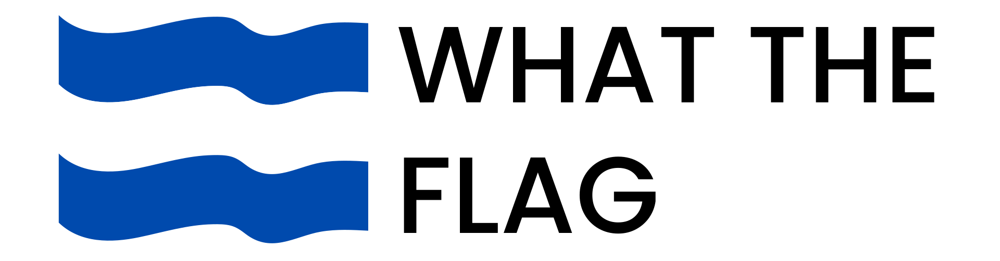
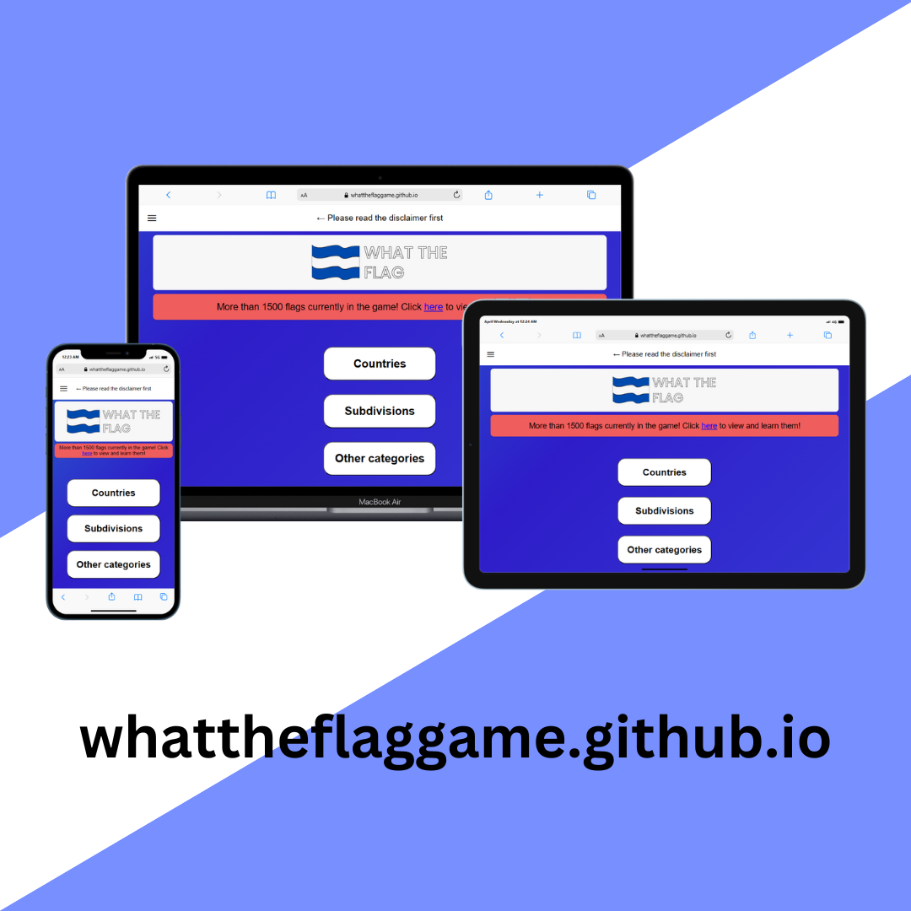

# <a href='https://whattheflaggame.github.io/'>whattheflaggame.github.io</a>

What the Flag is an online multiple choice flag guessing game that features over 1500 flags and many different game modes, such as subdivison or historical flags or even emblems. Try it now at <a href='https://whattheflaggame.github.io/'>whattheflaggame.github.io</a>!
 

